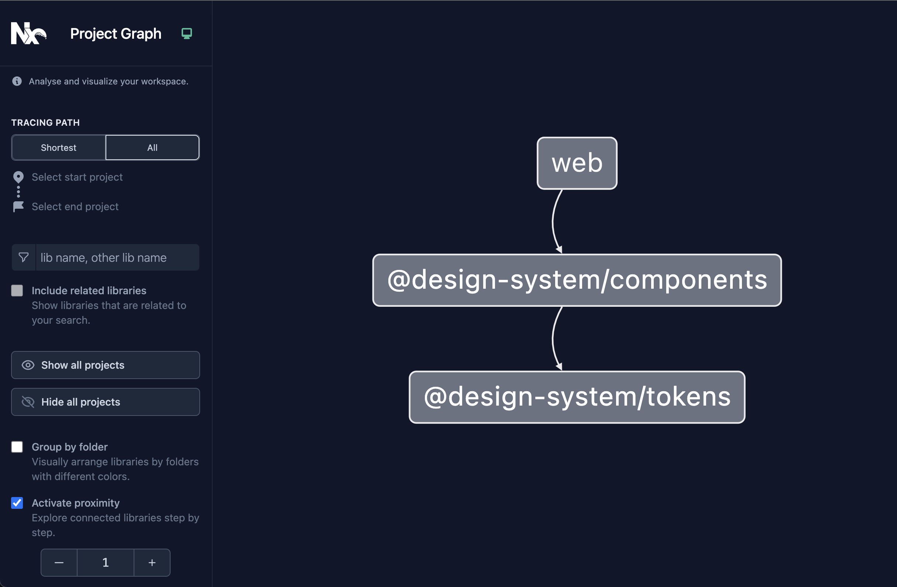
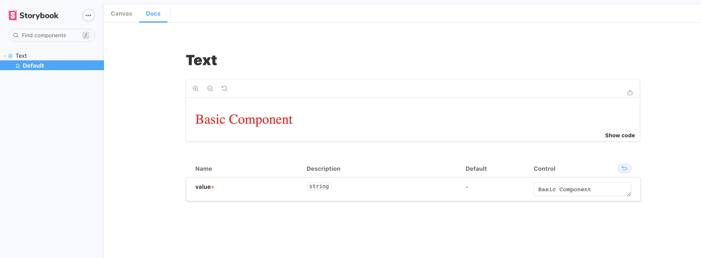

# Design System Project Example

This project contains a simple design system example with components and tokens with shared dependencies. The project use the monorepo structure, where each sub-module apply the atomic design concept.

## Modules Management

- [Lerna](https://lerna.js.org/)
- [Yarn Workspaces](https://classic.yarnpkg.com/lang/en/docs/workspaces/)

## Dependencies

- [Styled Components](https://styled-components.com/) for CSS-in-JS styling library
- [Storybook](https://storybook.js.org/) for components documentation
- [Typescript](https://www.typescriptlang.org/)
- [Prettier](https://prettier.io/) for code formatting
- [ESLint](https://eslint.org/) for code linter

## Pre-requisites

- [Node](https://nodejs.org/en/)
- [NPM](https://www.npmjs.com/) or [Yarn](https://yarnpkg.com/)

## Basic Commands

Use the above commands on root folder and with the same order:

- `yarn` to install all dependencies
- `yarn build` to build all the three sub-modules
- `yarn bootstrap` to run lerna bootstrap and link all modules
- `yarn start` to run the project

It will run a node server, using react-app on `localhost:3000`

## Useful Commands

- `yarn doc` to open compile and open the storybook
- `yarn graph` to open [NX](https://nx.dev/) to run the dashboard with dependencies tree

## Modules

- `@design-system/components` contains an example of component using CRA library
- `@design-system/tokens` contains the tokens of design system as colors and fontSize for example
- `web` contains CRA project to display all components and tokens (not necessary for design system, only for example purposes)

## Modules Tree

## Storybook

